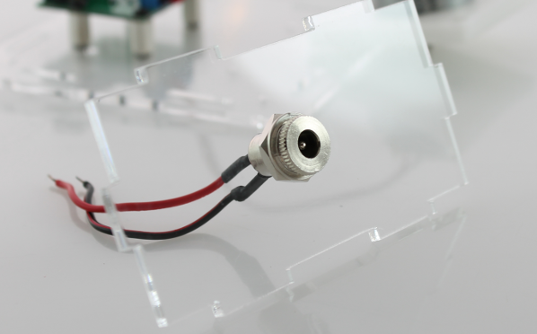

Step 3: Connecting power jack to the PCB
================================================

Power jack assembly
------------------------------------

**Parts: acrylic side with power cutout, DC power jack**

Take the power jack and unscew the nut and washer. Pass the power jack wires through the hole in the acrylic part and use the washer and nut to secure it in place.

   
   
   
Connecting power jack to the PCB
----------------------------------

Connect the wires from the DC power jack to the second PCB terminal block (position P1) with the red wire to '3V3' and the black wire to 'GND'. Again use the flat-end of the blade in the scewdriver to secure the wires. 

.. figure:: step_3B.png
   :align:  center

   
Optional: Quick test
----------------------------------

At this point it is probably a good idea to do a quick check that everything is connected correctly before completing the enclosure assembly. Plug the 3V power supply in to the DC Jack and switch on the PCB. If everything is working correctly you should see the blue LED light up and the motor speed increase as you turn up the potentiometer. 
This also serves as a good check to make sure that the magnet hub is not rubbing against the motor base. If it is, adjust the height of the magnet hub until there is a slight gap between the two parts.