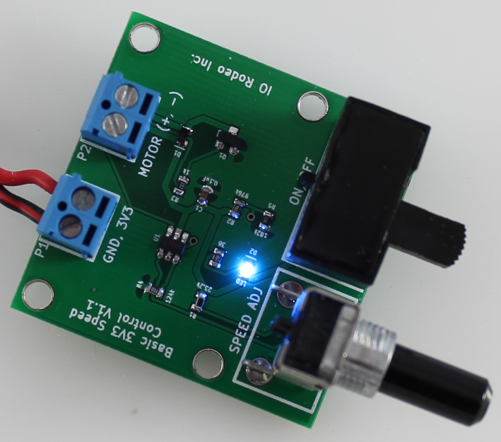

Basic speed control PCB
===========================================
The basic speed control PCB uses Pulse Width Modulation (PWM) to control the speed of a 3.3V DC motor.  The design is based on the `LTC6692 <www.linear.com/product/LTC6992-1>`_ voltage controlled pulse width modulator.  

PCB Bill of Materials
------------------------

=====  =====     ==============================   ====================   ===================           
Qty    Pos       Description                      Vendor                 Part #  
=====  =====     ==============================   ====================   ===================           
1      SW1       Slide switch                     Digikey                CKC5102-ND
1      RV1       Right angle potentiometer        Digikey                P3T9103-ND
1      C1        Capacitor 0.1uF                  Digikey                1276-1258-1-ND
1      D1        Diode, schottky (fast resp)      Digikey                641-1332-1-ND 
2      P1,P2     terminal block, 3.5mm vert       Digikey                ED2635-ND 
1      Q1        npn transistor                   Digikey                FMMT619CT-ND
1      R1        Resistor 23.2k                   Digikey                P23.2KHCT-ND
1      R2        Resistor 976k                    Digikey                RMCF0603FT976KCT-ND
1      R3        Resistor 1k                      Digikey                RMCF0603JT1K00CT-ND
1      R4        Resistor 124k                    Digikey                311-124KDCT-ND
1      R5        Resistor 182k                    Digikey                541-182KHCT-ND 
1      R6        Resistor 36 ohm                  Digikey                311-36GRCT-ND
1      D2        LED indicator, blue              Digikey                160-1827-1-ND
1      U1        Voltage controlled PWM           Digikey                LTC6992CS6-1#TRMPBFCT-ND
=====  =====     ==============================   ====================   ===================           

