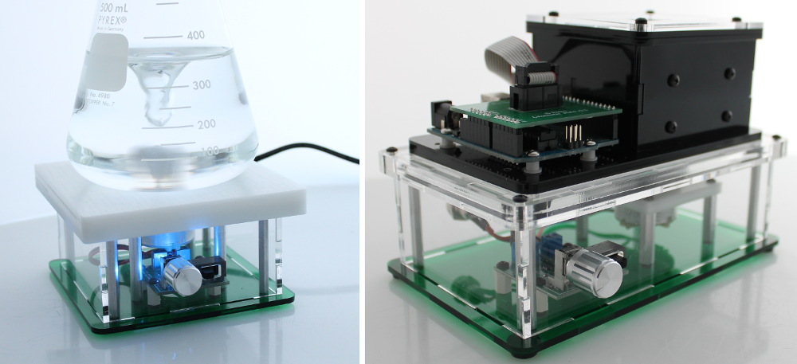

.. Stir Plate Kit documentation master file, created by
   sphinx-quickstart on Thu Feb 27 13:13:42 2014.
   You can adapt this file completely to your liking, but it should at least
   contain the root `toctree` directive.

Open Source DIY Kit
==========================================
This is the documentation site for the stir plate kits - both the `Desktop Stir Plate <http://www.iorodeo.com/content/desktop-stir-plate-kit>`_ and the `Colorimeter Stir Plate <http://http://www.iorodeo.com/content/colorimeter-stir-plate-kit>`_ 
The kits are very easy to assemble - **no soldering** is required and **tools are included** with the kits. See Assembly Instructions beginning with :ref:`assembly_label`
Each kit also includes a suitable stir bar so you can start using the stir plates right away. A full list of kit contents can be found on the :ref:`contents_label` page

Desktop Stir Plate Kit
------------------------------

* Build a stir plate suitable for many general purpose lab applications such as buffer, reagent and media preparation. 
* 4.5" x 4.5" surface area for beakers, flasks, cylinders and other glassware. The stir plate surface is a smooth, white material (delrin/acetal). 
* For use with glassware with a base diameter of up to 11mm max (typically up to and including 1L size flasks). 
* Stir plate height on the benchtop is 2.5". Multiple color options are available for the base.
* The stir plate is designed so that the magnet hub sits close to the stir bar (approx. 1/8" distance between magnets and bottom of flask). 
* Stir-plate has a variable speed control to allow for a range of speed from very slow to very rapid mixing.
* A blue LED indicator displays whether the stir-plate is on. 

Colorimeter Stir Plate 
---------------------------------

* Build a stir plate for use with the colorimeter to add cuvette stirring during measurement. Useful when carrying out titrations,enzyme assays and growth curves. 
* Dimensions: 4.5" x 4.5" x . 
* The stir plate is designed so that the magnet hub sits directly underneath the cuvette in the colorimeter. 
* Stir-plate has a variable speed control to allow for a range of speed from very slow to very rapid mixing.
* A blue LED indicator displays whether the stir-plate is on. 

License
------------
This is an open source hardware project licensed under the `Creative Commons Attribution 3.0 License <http://creativecommons.org/licenses/by/3.0>`_. 

Design files
---------------

* KiCad PCB design and Gerber files -  `https://bitbucket.org/iorodeo/basic_speed_control_3v3 <https://bitbucket.org/iorodeo/basic_speed_control_3v3>`_.
* Mechanical designs - `https://bitbucket.org/iorodeo/stir_plate_mechanics <https://bitbucket.org/iorodeo/stir_plate_mechanics>`_.

Table of Contents
------------------
.. toctree::
   :maxdepth: 1

   toc.rst
   
Search
==================

* :ref:`search`

