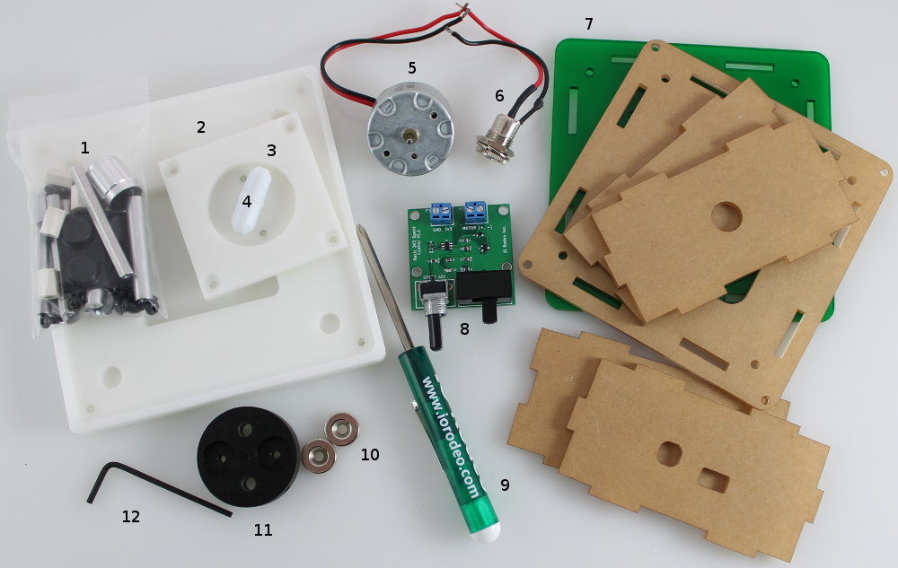

.. _contents_label:

Kit Contents - checklist
===============================

Once you receive your kit, you should check that it contains all of the parts listed below:

#. **Hardware** - for a full list of contents see :ref:`hardware_label` page
#. **Stir-plate top** - Desktop kit version only
#. **Motor mount**
#. **PTFE Stir-bar**. Either a `25 mm x 8 mm stir bar <http://www.iorodeo.com/content/stir-bar>`_ (desktop kit) or `cuvette 7 mm x 3 mm stir bar <http://www.iorodeo.com/content/cuvette-stir-bar>`_.
#. **3V DC Motor**. Pre-wired for connecting to the basic speed control PCB.
#. **DC Panel mount jack**. Pre-wired for connecting to the basic speed control PCB.
#. **Acrylic enclose** with colored base of your choice. A desktop enclosure is shown in the image above.
#. **Basic speed control PCB**. Pre-assembled with components.
#. **Mini-screwdriver** with reversible blade.
#. **Pair of magnets**
#. **Magnet mount**
#. **L-wrench**
#. **3.3V Power supply** (image not shown)
#. **250 mL beaker**. `Borosilicate glass beaker <http://www.iorodeo.com/content/250ml-beaker>`_ (image not shown). Desktop kit version only. 

Each of these components is described in more detail on the next few pages.